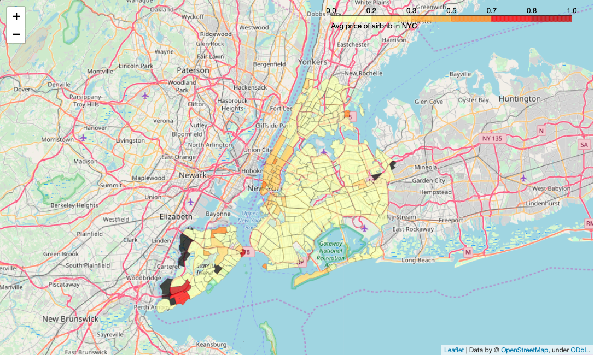

# Airbnb-neighbourhood-traveltime
# 1. Problem:

To build an intelligent system which:-

1. Helps tourists select appropriate Airbnb by considering price, neighborhood safety, distance to famous tourist spots or nearest subway station

2. Helps investor predict which location is best to open an Airbnb for maximum profit  

# 2. Motivation:  
Majority of times tourist is unaware of the city's neighborhood he/she is traveling to, it is hard for them to select an excellent location which is most convenient for their travel plan. The main aim of this project is to do the heavy lifting for them.

 The recommendation will be made considering various factors- safety, restaurant quality, distance to famous tourist spot and accessibility to transportation.

### Plot - Comparing neighbourhoods with respect to average price of airbnb

